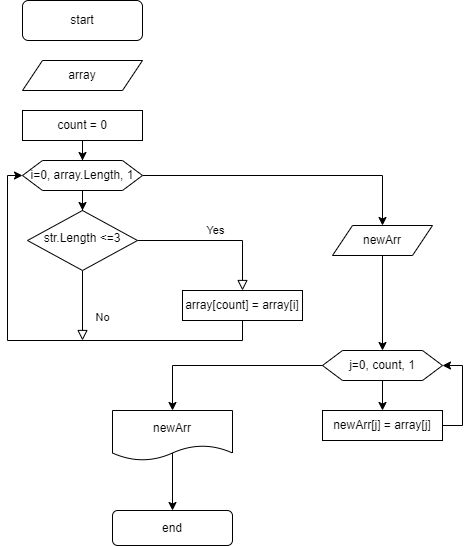

### Итоговый проект блока "Выбор специализации"

##### Задание:
- Написать программу, которая из имеющегося массива строк формирует массив строк, длина которых меньше либо равна 3 символа.

##### Решение:
1. Задаем массив строк
2. Ищем элементы массива, длина которых меньше или равна 3
3. Сохраняем эти элементы в начале массива
4. Создаем новый массив длиной равной количеству найденных элементов и заполняем его этими элементами.

